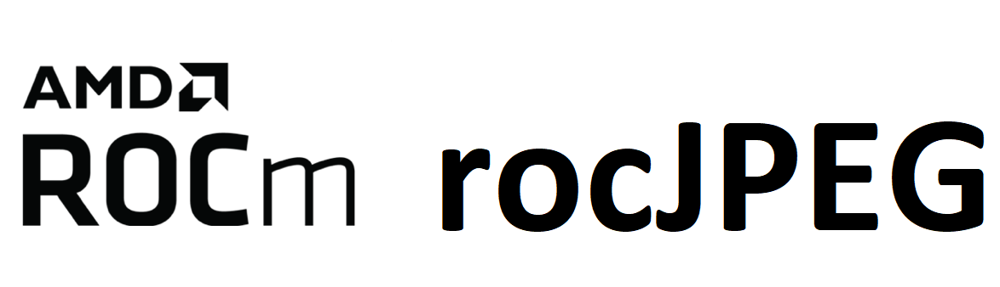

[](https://opensource.org/licenses/MIT)


<p align="center"></p>

rocJPEG is a high performance JPEG decode SDK for AMD GPUs. rocJPEG API lets developers access the JPEG decoding features available on the GPU.

## Supported JPEG chroma subsampling

* YUV 4:4:4
* YUV 4:2:2
* YUV 4:2:0
* YUV 4:0:0

## Prerequisites

* Linux distribution
    * Ubuntu - `20.04` / `22.04`
    * RHEL - `8` / `9`
    * SLES - `15-SP4`

* [ROCm supported hardware](https://rocm.docs.amd.com/projects/install-on-linux/en/latest/reference/system-requirements.html)
    * **NOTE:** `gfx908` or higher required

* Install ROCm `6.1.0` or later with [amdgpu-install](https://rocm.docs.amd.com/projects/install-on-linux/en/latest/how-to/amdgpu-install.html) with `--usecase=multimediasdk,rocm --no-32`
    * **NOTE:** To install rocjpeg with minimum requirements follow instructions [here](https://github.com/ROCm/rocJPEG/wiki#how-can-i-install-rocjpeg-runtime-with-minimum-requirements)

### To build from source

* CMake `3.5` or later

```shell
sudo apt install cmake
```

* [pkg-config](https://en.wikipedia.org/wiki/Pkg-config)

```shell
sudo apt install pkg-config
```

**NOTE:**

* All package install shown with `apt` package manager, use appropriate package manager depending on the OS.

* Ubuntu 22.04 - Install `libstdc++-12-dev`

```shell
sudo apt install libstdc++-12-dev
```

#### Prerequisites setup script for Linux

For the convenience of the developer, we provide the setup script [rocJPEG-setup.py](rocJPEG-setup.py) which will install all the dependencies required by this project.

**Usage:**

```shell
  python rocJPEG-setup.py  --rocm_path [ ROCm Installation Path - optional (default:/opt/rocm)]
                             --developer [ Setup Developer Options - optional (default:ON) [options:ON/OFF]]
```

**NOTE:** This script only needs to be executed once.

## Build and install instructions

### Package install

Install rocJPEG runtime, development, and test packages.

* Runtime package - `rocjpeg` only provides the rocjpeg library `librocjpeg.so`
* Development package - `rocjpeg-dev`/`rocjpeg-devel` provides the library, header files, and samples
* Test package - `rocjpeg-test` provides ctest to verify installation

**NOTE:** Package install will auto install all dependencies.

#### Ubuntu

```shell
sudo apt install rocjpeg rocjpeg-dev rocjpeg-test
```

#### RHEL

```shell
sudo yum install rocjpeg rocjpeg-devel rocjpeg-test
```

#### SLES

```shell
sudo zypper install rocjpeg rocjpeg-devel rocjpeg-test
```

### Source build and install

```shell
git clone https://github.com/ROCm/rocJPEG.git
cd rocJPEG
mkdir build && cd build
cmake ../
make -j8
sudo make install
```

* run tests

  ```shell
  make test
  ```

  **NOTE:** run tests with verbose option `make test ARGS="-VV"`

* make package
  
  ```shell
  sudo make package
  ```

## Verify installation

The installer will copy

* Libraries into `/opt/rocm/lib`
* Header files into `/opt/rocm/include/rocjpeg`
* Samples folder into `/opt/rocm/share/rocjpeg`
* Documents folder into `/opt/rocm/share/doc/rocjpeg`

### Verify with sample application

```shell
mkdir rocjpeg-sample && cd rocjpeg-sample
cmake /opt/rocm/share/rocjpeg/samples/jpegDecode/
make -j8
./videodecode -i /opt/rocm/share/rocjpeg/image/mug.jpg
```

### Verify with rocjpeg-test package

Test package will install ctest module to test rocjpeg. Follow below steps to test packge install

```shell
mkdir rocjpeg-test && cd rocjpeg-test
cmake /opt/rocm/share/rocjpeg/test/
ctest -VV
```

## Samples

The tool provides a few samples to decode JPEG images [here](samples/). Please refer to the individual folders to build and run the samples.

## Docker

Docker files to build rocJPEG containers are available [here](docker/)

## Documentation

Run the steps below to build documentation locally.

* Sphinx

```shell
cd docs
pip3 install -r sphinx/requirements.txt
python3 -m sphinx -T -E -b html -d _build/doctrees -D language=en . _build/html
```

* Doxygen

```shell
doxygen .Doxyfile
```

## Tested configurations

* Linux distribution
    * Ubuntu - `20.04` / `22.04`
    * RHEL - `8` / `9`
    * SLES - `15-SP4`
* ROCm:
    * rocm-core - `6.1.0.60100-crdnnh.13370`
    * amdgpu-core - `1:6.1.60100-1717660`
* rocJPEG Setup Script - `V1.0`
